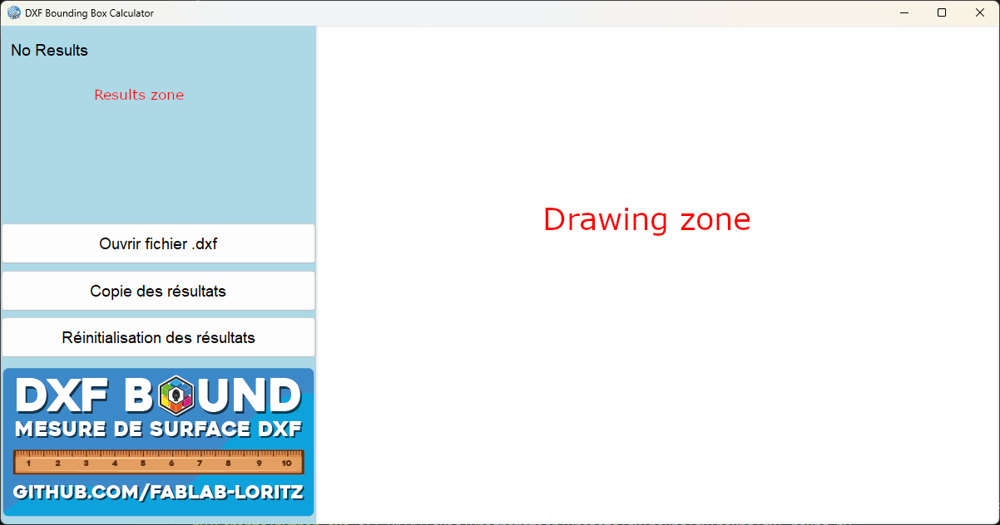

# DXF Bounding Box Calculator

Le **DXF Bounding Box Calculator** ou **DXF_Bound** est un outil interactif permettant de lire, analyser, visualiser et calculer les dimensions des fichiers DXF. Il offre des fonctionnalités pour traiter un ou plusieurs fichiers DXF et afficher leurs dimensions, ainsi que leur surface.




---

## Fonctionnalités
- **Lecture et analyse des fichiers DXF :**
  - Prend en charge les entités principales : `LINE`, `LWPOLYLINE`, `POLYLINE`, `CIRCLE`, `ARC`, `ELLIPSE`, `SPLINE`.
  - Détermine la largeur, la hauteur et la surface de chaque fichier DXF.
  - Conversion automatique des unités (mm, cm, m).

- **Visualisation des fichiers DXF :**
  - Affichage graphique des entités DXF en 2D avec `tkinter.Canvas`.
  
- **Résultats cumulés :**
  - Analyse et addition des surfaces de plusieurs fichiers DXF.

- **Interface utilisateur conviviale :**
  - Interface graphique avec des boutons pour charger et visualiser des fichiers DXF, ainsi que pour afficher les résultats cumulés.

---

## Prérequis

Avant de commencer, assurez-vous d'avoir installé les bibliothèques suivantes :

- **Python 3.8+**
- `ezdxf`
- `Pillow` (pour le traitement des images)
- `tkinter` (inclus avec Python par défaut)

L'utilisation de `venv` et du fichier `requirements.txt` est fortement conseillé pour développer l'application

Pour installer les dépendances, exécutez :
```bash
pip install -r requirements.txt
```

---

## Utilisation

1. **Téléchargez le projet :**
   ```bash
   git clone https://github.com/fablab-loritz/dxf-bounding-box.git
   cd dxf-bounding-box
   ```

2. **Lancez le programme :**
   ```bash
   python dxf_bound.py
   ```

3. **Interagissez avec l'interface graphique :**
   - Cliquez sur **Ouvrir fichier .dxf** pour analyser un fichier DXF. On peut selectionner plusieurs fichier. Seul le dernier ficher est affiché.
   - Cliquez sur **Copie des résultats** afin de copier la somme cumulé en m²
   - Cliquez sur **Réinitialisation des resultats** pour réinitialiser les résultats cumulés.

---

## Fonctionnement

### Calcul des dimensions
Le programme extrait les entités dans l'espace modèle (`modelspace`) et calcule les coordonnées minimales et maximales pour déterminer la largeur, la hauteur et la surface des fichiers DXF.

### Visualisation des fichiers DXF
Les entités DXF sont tracées en utilisant `tkinter.Canvas`

---

## Commande de compilation
Pour compiler l'application pour windows executer cette commande dans le dossier du projet

```bash
pyinstaller --onefile --noconsole --icon=logo_dxf_bound.ico --add-data "logo_dxf_bound.ico;." --add-data "image_logiciel.png;." dxf_bound.py
```
 
## Contact

Pour toute question ou suggestion ou erreur, contactez-nous à [fablab@loritz.fr](mailto:fablab@loritz.fr) ou créer une nouvelle [Issue](https://github.com/fablab-loritz/dxfbound/issues)

## Licence

Ce projet est distribué sous la licence [Creative Commons Attribution-NonCommercial 4.0 International (CC BY-NC 4.0)](https://creativecommons.org/licenses/by-nc/4.0/).
